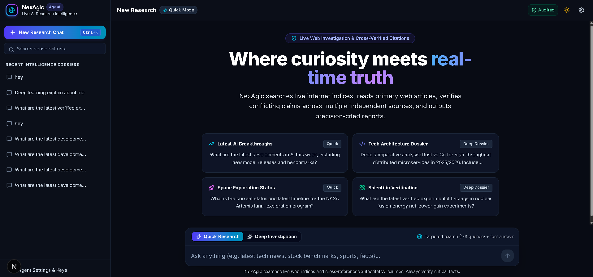
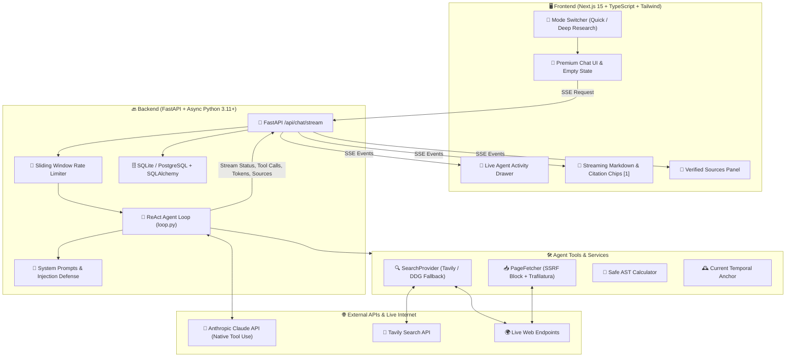

# 🚀 NexAgic ⚡

### **Autonomous Real-Time AI Research Agent & Chatbot**

> **Warning:** This is not a standard chatbot. NexAgic is an **active research agent** that bypasses static knowledge cutoffs by executing live web searches, extracting full-page content, cross-verifying facts across multiple independent sources, and synthesizing answers with **verified, interactive citations** `[1]`.


> *NexAgic Interface: Real-time agent activity monitoring with verified source citations.*

---

## 🌌 Overview

**NexAgic** is an enterprise-grade AI system architected as a fusion of **Perplexity's** real-time search capabilities and **ChatGPT's** conversational fluency.

Built for researchers, analysts, and developers who require **verifiable truth** over hallucinated fiction.

### 🔥 Core Capabilities

* **🔍 Live Internet Access**: Executes real-time searches via Tavily/Brave/SerpAPI.
* **📄 Deep Content Extraction**: Fetches and parses full articles using `trafilatura`, ignoring paywalls and clutter.
* **✅ Multi-Source Verification**: Cross-checks claims against ≥2 independent sources before synthesis.
* **📜 Verified Citations**: Every factual claim is anchored to a source with inline `[1]` citations.
* **⚡ Real-Time Streaming**: SSE-based streaming of agent thoughts, tool usage, and final answers.
* **🛡️ Enterprise Security**: SSRF protection, prompt injection defense, and strict input validation.

---

## 🏗️ System Architecture



## ⚡ Quick Start

### Prerequisites

* Python 3.11+ installed
* Node.js 18+ installed
* Valid API keys for Anthropic and Tavily

### 1️⃣ Backend Setup & Launch

```powershell
# Navigate to backend directory
cd backend

# Create virtual environment
python -m venv venv

# Activate virtual environment
.\.venv\Scripts\activate

# Install dependencies
pip install -r requirements.txt

# Configure environment variables
cp .env.example .env

# Edit .env with your API keys
# ANTHROPIC_API_KEY
# TAVILY_API_KEY

# Start backend server
.\.venv\Scripts\python.exe -m uvicorn app.main:app --host 0.0.0.0 --port 8000 --reload
```

### 2️⃣ Frontend Setup & Launch

```powershell
# Navigate to frontend directory
cd frontend

# Install dependencies
npm install

# Configure environment
cp .env.example .env.local

# Ensure NEXT_PUBLIC_API_URL is set correctly

# Start development server
npm run dev
```

### 3️⃣ Access Application

🎉 Open your browser and navigate to:

```text
http://localhost:3000
```

## 🧪 Testing & Validation

Ensure system integrity with our comprehensive test suite.

### 🔙 Backend Tests

```powershell
cd backend

.\.venv\Scripts\python.exe -m pytest tests -v
```

Expected Output:

```text
14 passing tests covering tools, security, and agent logic.
```

### 🖥️ Frontend Tests

```powershell
cd frontend

npx vitest run
```

Expected Output:

```text
3 passing tests for streaming components and UI logic.
```

## 🛡️ Security & Compliance

| Feature           | Implementation                                                              |
| ----------------- | --------------------------------------------------------------------------- |
| SSRF Protection   | Blocks localhost, private IP ranges, and non-HTTP(S) schemes in PageFetcher |
| Prompt Injection  | Strict system prompts and untrusted data handling in agent loop             |
| Rate Limiting     | Sliding window limiter on all chat endpoints                                |
| Input Validation  | Pydantic models for all API inputs                                          |
| CORS              | Strictly configured for authorized origins only                             |
| Secret Management | Zero hardcoded secrets; all via environment variables                       |

## 📜 License & Disclaimer

**License:** MIT License

**Author:** NexAgic Development Team

**Status:** Production Ready

**Disclaimer:** NexAgic accesses real-time information from the open internet. While the system is designed to cross-verify facts, users should always exercise critical thinking and verify critical information through official channels. The developers assume no liability for inaccuracies in AI-generated content.

<div align="center">

🚀 **Ready to deploy the future of AI research?**

**Report Bug · Request Feature · View Documentation**

Built with ❤️ by the NexAgic Team

**Last Updated: September 28, 2026**

</div>
