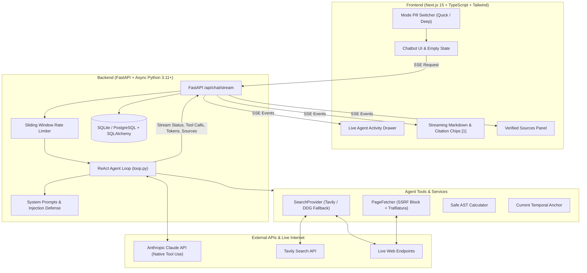

# NexAgic ⚡
### Autonomous Real-Time AI Research Agent & Chatbot

NexAgic is an enterprise-grade AI research agent designed like a fusion of Perplexity and ChatGPT. Unlike typical chatbots limited by static training cutoff dates, NexAgic actively searches the live web, fetches and extracts deep article content, cross-verifies claims across independent sources, and synthesizes answers with interactive, verified citations `[1]`.

The complete project codebase is arranged in [`backend/`](./backend/) and [`frontend/`](./frontend/).

---

## 🏗️ Architecture Diagram



---

## 🚀 Quick Run Commands

### 1. Start the Backend:
```powershell
cd backend
.\.venv\Scripts\python.exe -m uvicorn app.main:app --host 0.0.0.0 --port 8000 --reload
```

### 2. Start the Frontend:
```powershell
cd frontend
npm run dev
```

Visit **`http://localhost:3000`** in your browser!

---

## 🧪 Test Commands

### Backend Tests (14 passing tests):
```powershell
cd backend
.\.venv\Scripts\python.exe -m pytest tests -v
```

### Frontend Tests (Vitest 3 passing tests):
```powershell
cd frontend
npx vitest run
```

